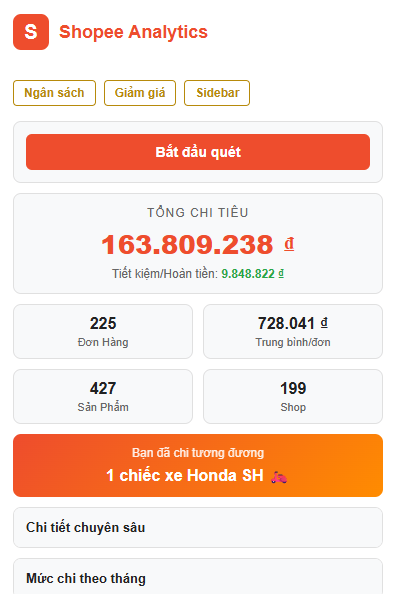

# Shopee Analytics 🛒

**Shopee Analytics** là một tiện ích mở rộng (extension) trên trình duyệt giúp bạn thống kê và phân tích chi tiết lịch sử mua sắm, chi tiêu trên Shopee một cách trực quan, tự động và đặc biệt là **hỗ trợ bypass lỗi 403** khi quét dữ liệu. Không chỉ cung cấp số liệu khô khan, extension còn mang đến nhiều tính năng thú vị để giúp bạn quản lý tài chính thông minh hơn.

## 🌟 Các tính năng nổi bật

- 📊 **Thống Kê Chi Tiêu Chi Tiết:** Tính toán tổng số tiền đã tiêu, tổng số tiền tiết kiệm được, số lượng đơn hàng, số shop đã mua, ngày mua hàng đầu tiên...
- 📈 **Biểu Đồ Trực Quan:** Xem biểu đồ chi tiêu theo từng tháng giúp bạn biết được tháng nào "vung tay quá trán".
- 💸 **Quy Đổi Bằng Vật Phẩm Thú Vị:** Xem số tiền đã tiêu tốn bằng số ly trà sữa, chiếc AirPods, hay cả một chiếc xe máy... 
- 🎯 **Quản Lý Ngân Sách (Budget):** Đặt hạn mức chi tiêu hàng tháng. Extension sẽ hiển thị thanh tiến độ và tự động **cảnh báo đỏ** nếu bạn tiêu vượt ngân sách.
- 📉 **Theo Dõi Giá Sản Phẩm (Price Watch):** Lưu link sản phẩm bạn đang nhắm tới. Extension sẽ theo dõi và cảnh báo nếu giá tăng/giảm so với dự kiến.
- 🖼️ **Flex Chi Tiêu Với Poster:** Xuất ảnh tổng quan chi tiêu cực xịn xò để khoe với bạn bè trên mạng xã hội.
- 📁 **Xuất Dữ Liệu CSV:** Dễ dàng tải xuống lịch sử đơn hàng dưới dạng file Excel/CSV phục vụ cho việc quản lý cá nhân.
- 🚀 **Hỗ Trợ Sidebar (Side Panel):** Tiện lợi theo dõi giá cả và số liệu ngay bên cạnh màn hình mua sắm trên Shopee mà không cần mở popup nhiều lần.

## 📸 Screeshots

## 🛠️ Hướng dẫn cài đặt

Vì tiện ích này chưa được tải lên Chrome Web Store, bạn có thể cài đặt trực tiếp qua mã nguồn (Developer Mode) theo các bước sau:

1. **Tải mã nguồn:** Nhấn vào `Code` > `Download ZIP` rồi giải nén 
2. Mở trình duyệt Chrome (hoặc Edge, Brave, Cốc Cốc...) và truy cập vào trang quản lý Tiện ích:
   - Chrome: `chrome://extensions/`
   - Edge: `edge://extensions/`
3. Ở góc trên cùng bên phải, bật công tắc **Chế độ dành cho nhà phát triển (Developer mode)**.
4. Nhấn vào nút **Tải tiện ích đã giải nén (Load unpacked)** ở góc trên bên trái.
5. Chọn thư mục chứa mã nguồn bạn vừa giải nén (thư mục chứa file `manifest.json`).
6. Cài đặt thành công! Hãy ghim thẻ (Pin) Shopee Analytics ra ngoài thanh menu trên trang web và bắt đầu theo dõi chi tiêu của bạn.

## 💡 Cách sử dụng

1. **Quét dữ liệu:** Truy cập trang web `https://shopee.vn/` (bắt buộc phải đăng nhập) và mở tiện ích Shopee Analytics. Nhấn **Quét dữ liệu / Cập nhật** và chờ đến khi thanh tiến trình đạt 100%.
2. **Theo dõi giá:** Bấm vào nút `Price Watch` (biểu tượng theo dõi), dán link sản phẩm Shopee yêu thích và tiện ích sẽ bắt đầu tự động kiểm tra giá.
3. **Mở Sidebar:** Nhấn nút mở Side Panel ngay trong popup để treo extension ở lề phải trình duyệt.

## ⚠️ Lưu ý

- Mọi quá trình quét dữ liệu diễn ra hoàn toàn ngay tại trình duyệt của bạn (Local). Extension **KHÔNG GỬI** bất kỳ dữ liệu cá nhân hay Cookie nào của bạn ra bên ngoài (có thể tra cứu mã nguồn mở này để kiểm chứng).
- Shopee thỉnh thoảng sẽ có các cập nhật thay đổi cấu trúc trang. Nếu không quét được, hãy kiên nhẫn đợi phiên bản cập nhật từ nguồn này nhé.

## 📝 Giấy phép (License)
Dự án được xây dựng với mục đích học tập và chia sẻ cộng đồng, MIT License.
